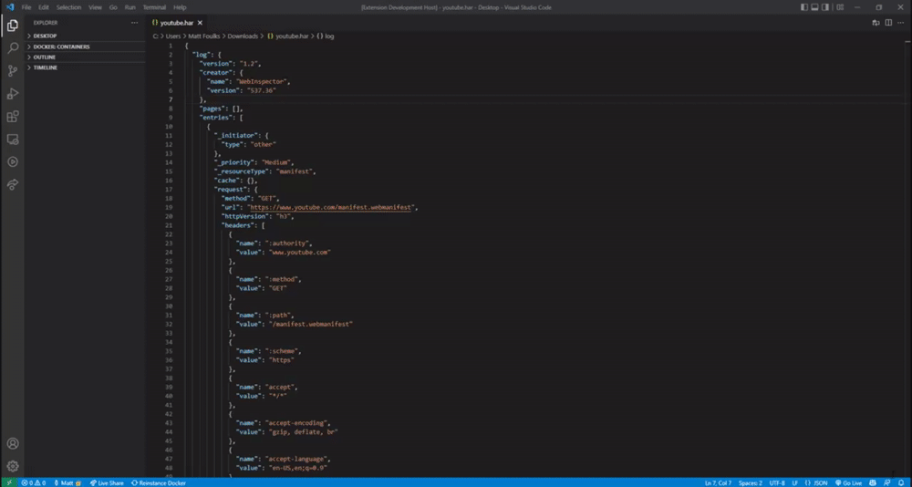

A first-class HAR file viewer for VS Code. Run the `Analyze` command while viewing a har file to open the analyzer.

_Note: VS Code disallows loading files over 5MB via the API. Unfortunately that means this extension will only work with files smaller than that. There is a [GitHub issue](https://github.com/microsoft/vscode/issues/31078) open to allow workarounds, but it is not yet implemented._